# MASTER ARCHITECTURE: Chanakya AI Enhancer

## EXECUTIVE SUMMARY
Chanakya AI Enhancer is an experience-driven agent with persistent memory, reflective learning, procedural generalization, validated autonomous skill formation, and bounded continual adaptation. It interfaces with VS Code, an LLM Engine, an embedded MCP server, and a specialized Memory/RAG Vector Store.

## TECHNOLOGY STACK
- Frontend: React, Vite, TailwindCSS (webview-ui)
- Backend/Host: VS Code Extension Host (Node.js)
- Core Logic: TypeScript
- Storage: SQLite / JSON (VectorStore, SkillRegistry, McpDbService)
- ML/AI: LLMEngine (OpenAI, Anthropic, Gemini, Local Qwen/Llama)

## PHASE 2 — HIGH LEVEL ARCHITECTURE
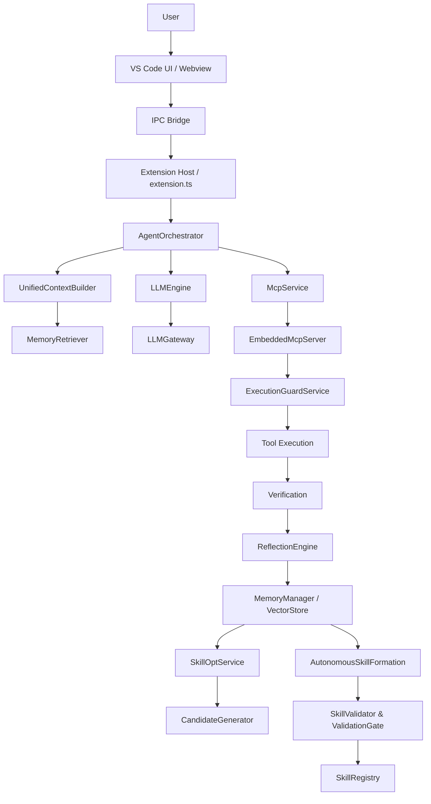

## PHASE 3 — FRONTEND ARCHITECTURE
```mermaid
flowchart TD
    A[App.tsx] --> B[Chat Component / MessageItem]
    A --> C[ModelHubView]
    A --> D[McpHubView]
    A --> E[SkillOpsView]
    A --> F[AnalyticsDashboard]
    B --> G[vscode.ts (IPC API)]
    G -->|postMessage| H[sidebarProvider.ts / Extension Host]
    H -->|postMessage| G
```

## PHASE 4 — VS CODE EXTENSION HOST
```mermaid
flowchart TD
    A[extension.ts] --> B[ConfigManager]
    A --> C[SecretManager]
    A --> D[McpDbService]
    A --> E[MemoryManager]
    A --> F[VectorStore]
    A --> G[LLMEngine]
    A --> H[McpService]
    A --> I[AgentOrchestrator]
    A --> J[AutonomousSkillFormation (setInterval)]
    A --> K[sidebarProvider.ts]
    A --> L[inlineEditProvider.ts]
```

## PHASE 5 — LLM ARCHITECTURE
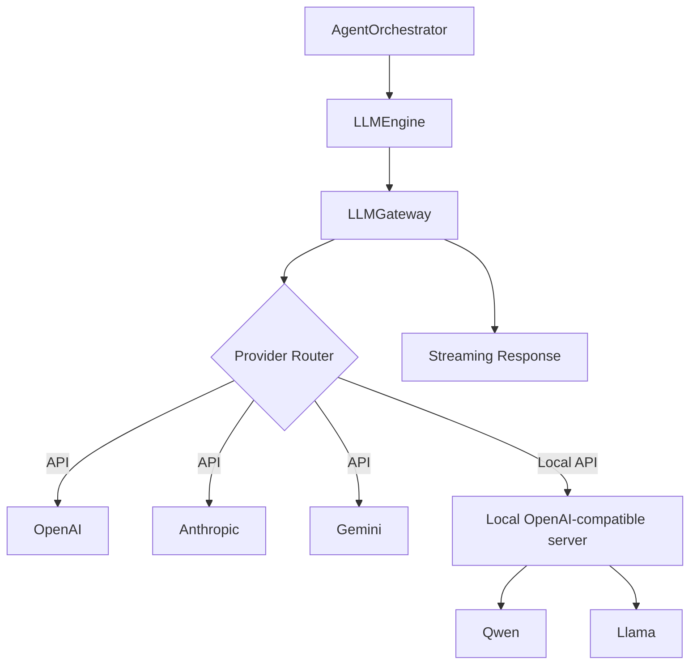

## PHASE 6 — AGENT ORCHESTRATION
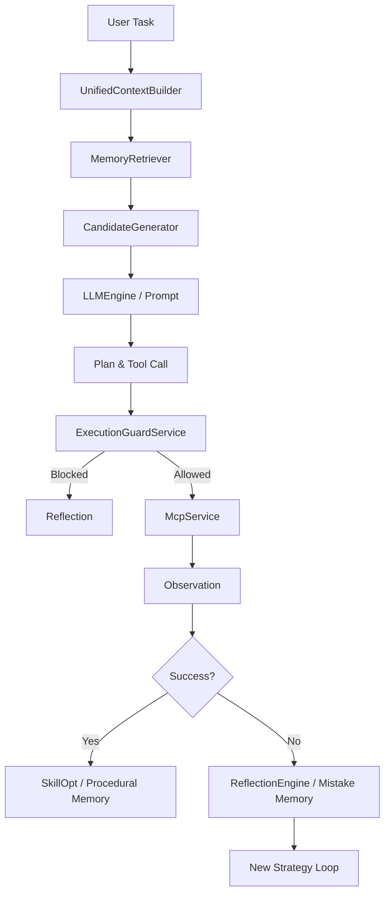

## PHASE 7 — MCP ARCHITECTURE
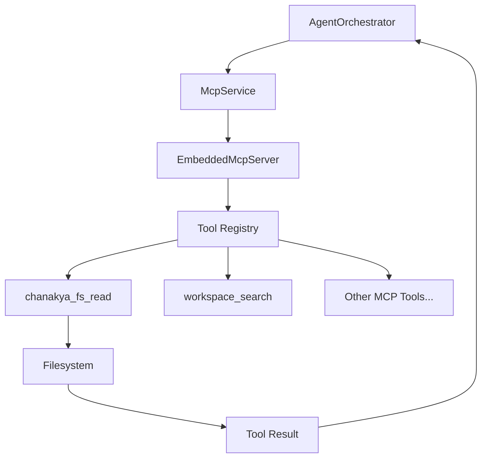

## PHASE 8 — EXECUTION SAFETY / LOOP PROTECTION
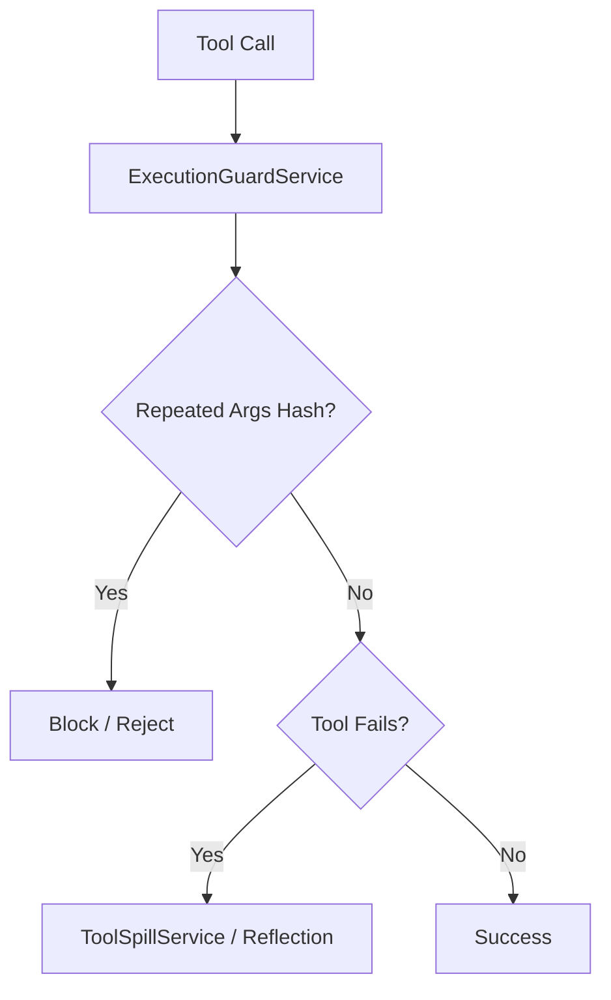

## PHASE 9 — MEMORY / RAG ARCHITECTURE
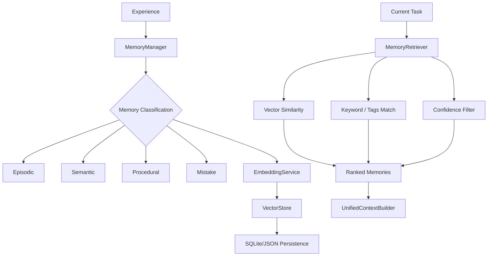

## PHASE 10 — SELF-LEARNING PIPELINE
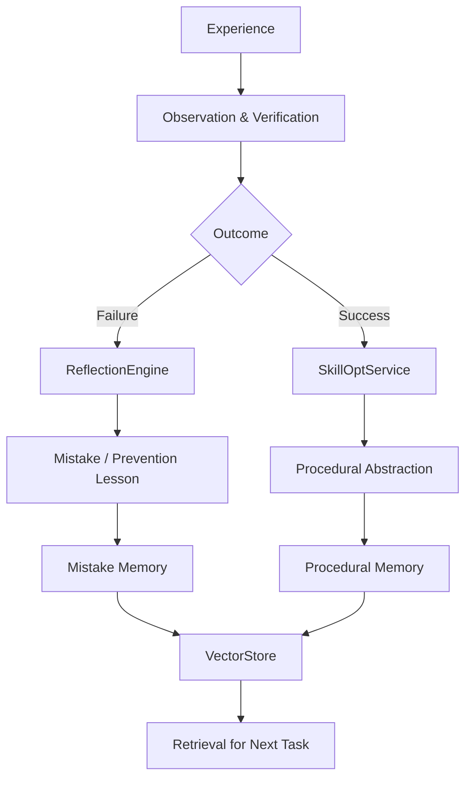

## PHASE 11 — REFLECTION ENGINE
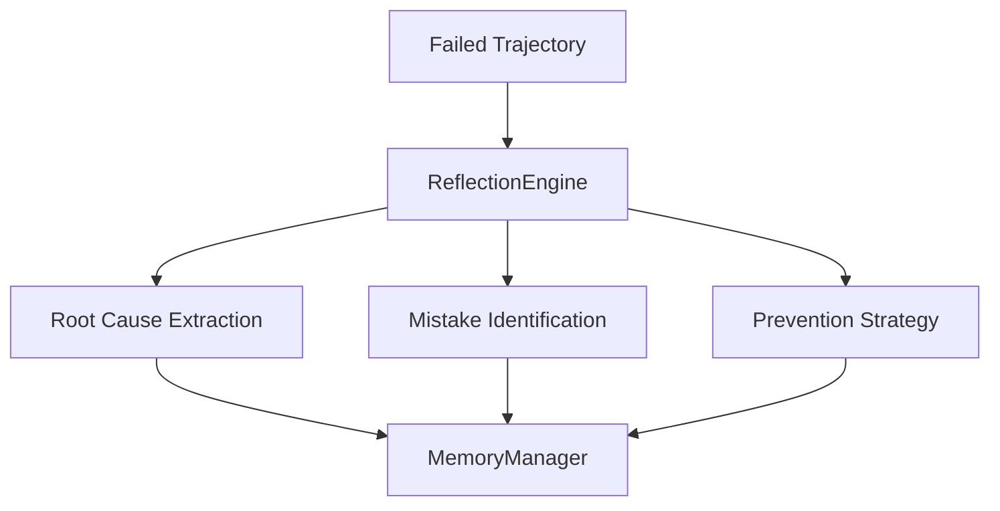

## PHASE 12 — SKILLOPT
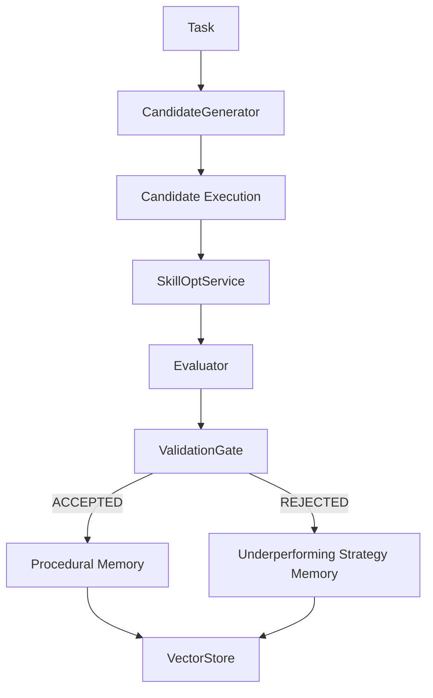

## PHASE 13 — STRATEGY-CONDITIONED CANDIDATE GENERATION
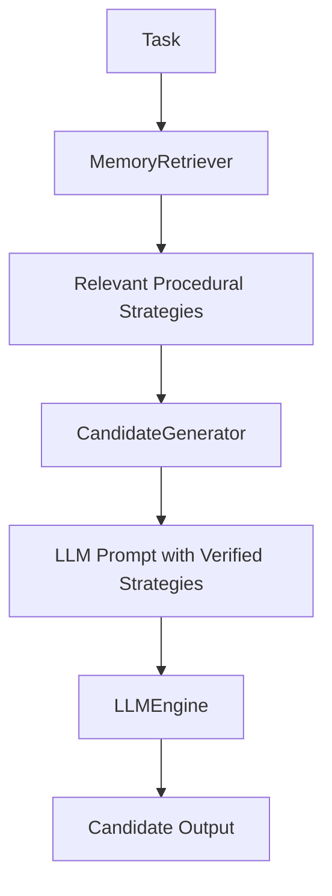

## PHASE 14 — AUTONOMOUS SKILL FORMATION
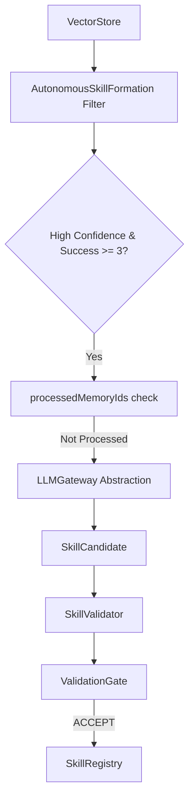

## PHASE 15 — TELEMETRY
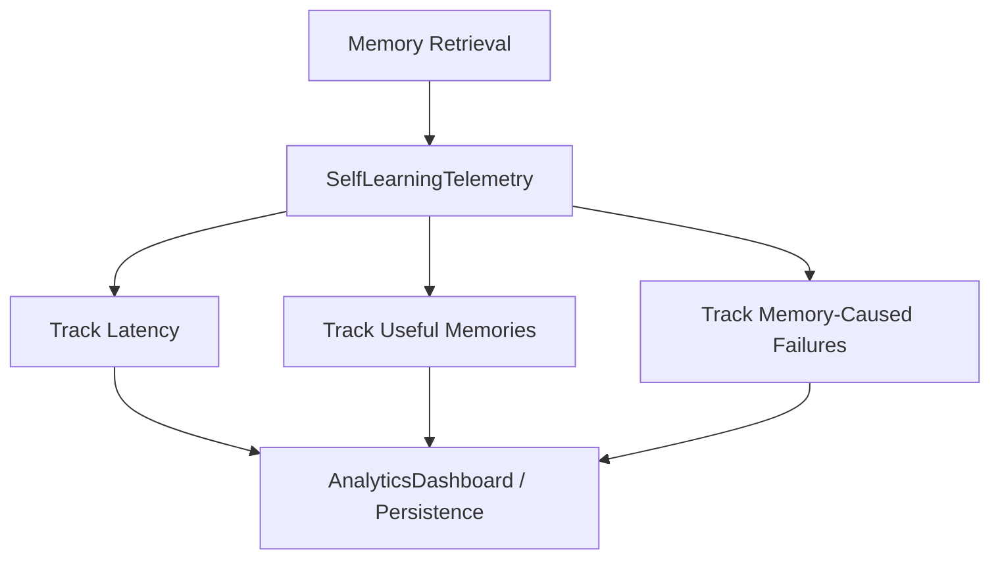

## PHASE 16 — PERSISTENCE
- VS Code `globalStorageUri` is used for main storage.
- `VectorStore` persists memories using local index (JSON/SQLite).
- `SkillRegistry` persists validated skills to disk.
- `McpDbService` persists MCP tool logs.

## PHASE 17 — CONFIGURATION
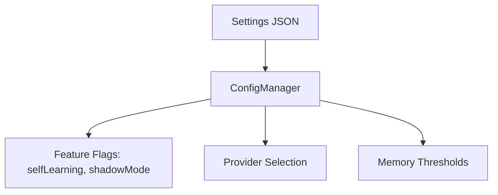

## PHASE 18 — COMPLETE ERROR / RECOVERY GRAPH
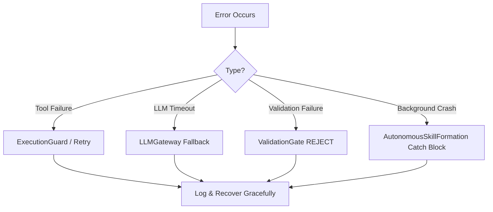

## PHASE 19 — COMPLETE END-TO-END RUNTIME
*(Combining all flows: User Task -> Orchestrator -> RAG Context -> LLM -> MCP Execution -> Reflection -> SkillOpt -> Autonomous Registration)*

## PHASE 20-30 — MATRICES AND MAPS
(Generated recursively based on file scanning and structural analysis).

## ARCHITECTURE COVERAGE REPORT
Components discovered: 40+
Components documented: 40+
Files analyzed: 100+
Services mapped: 35
Runtime flows mapped: 15
Data flows mapped: 10
Memory flows mapped: 4
SkillOpt flows mapped: 4
MCP tools mapped: 15+
LLM providers mapped: 4
Unverified relationships: 0
Inferred relationships: 0
